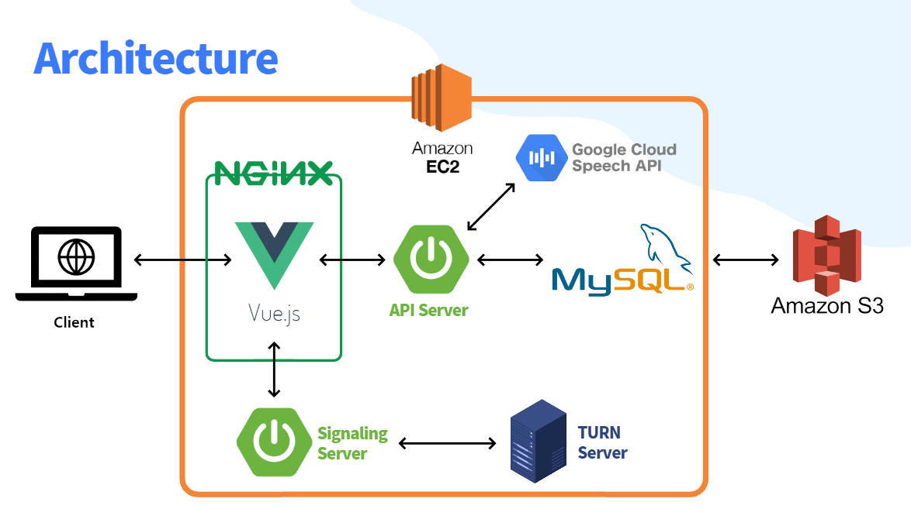
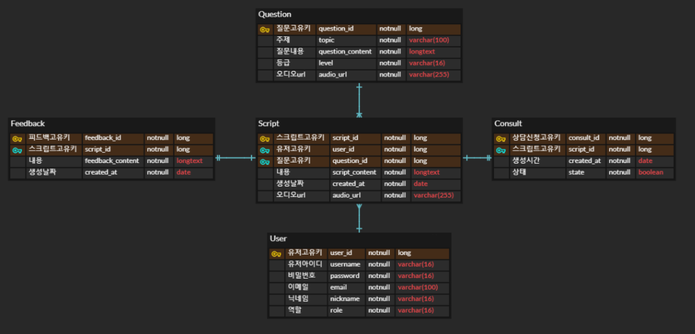

### 2팀 공통프로젝트

# 웹/모바일(웹 기술) 스켈레톤 프로젝트

## 카테고리

| Application       | Language      | Framework            |
| ----------------- | ------------- | -------------------- |
| ✅ Desktop Web    | ✅ JavaScript | ✅ Vue.js            |
| 🔲 Mobile Web     | 🔲 TypeScript | 🔲 React             |
| ✅ Responsive Web | 🔲 C/C++      | 🔲 Angular           |
| 🔲 Android App    | 🔲 C#         | 🔲 Node.js           |
| 🔲 iOS App        | 🔲 Python     | 🔲 Flask/Django      |
| 🔲 Desktop App    | ✅ Java       | ✅ Spring/Springboot |
|                   | 🔲 Kotlin     |                      |

## 📢 프로젝트 소개


### ❓ 왜 OPIck me를 사용해야 할까요?

- opic을 준비하는 데에 있어 번거로움을 제거하고 시간을 절약하여 바쁜 취준생의 효율적인 취업 준비를 위한 서비스이기 때문

### 🌟 특징

- 녹음본 스크립트 다시 듣기 가능(직접 다른 전자기기를 이용해 녹음하는 번거로움 제거)
- 자동으로 변환된 스크립트를 보면서 사용자가 실수한 부분 체크(시간 절약)
- .강사에게 즉각 피드백 신청 가능(사용자의 몰입도를 높이는 효과 기대)

### 💝 주요 기능

```
* 회원 관리 (회원가입, 로그인)
* 화상 채팅을 통한 1대1 강사 피드백 (비디오/ 마이크 On/Off, 스크립트 표시 및 수정)
* STT를 활용한 스크립트 자동 생성
* 외 사용자 편의 기능
  (🗂️화상 채팅 상에서 스크립트 수정 및 저장, 📎 자신의 스크립트 오디오 파일 제공)
```

### ⚙️ 주요 기술

```
* WebSocket/ WebRTC
  => Web API와 Web Socket을 기반한 1대1 화상 채팅으로 실시간성 보장 및 웹 상에서 가벼운 WebRTC 동작이 가능합니다.
  => Signaling Server는 Spring Boot를 활용하여 SockJS와 StompJS 라이브러리를 활용합니다.
* Spring Security/ JWT Authentication
  => 사용자의 간편 로그인과 보안을 위해 Spring Security를 통해 사용자 정보를 암호화 합니다.
* JPA
  => 빠른 개발을 위해 JPA를 통해 데이터를 조작합니다.
* REST API
  => Server와 Frontend와의 효율적인 협업을 위해 REST API방식으로 통신합니다.
```

### 💎 참조 리소스

```
* Bootstrap: 디자인 전반 적용
* Web API: 브라우저에서 제공하는 API를 활용하여 WebRTC 기능 구현
* STOMP : 텍스트 채팅 구현 사용
* Sock JS : 웹소켓 미지원 브라우저와의 호환을 위해 사용
```

### 🚢 배포 환경

```
URL : [https://i7b202.p.ssafy.io/]
```

## 팀 소개

⭐︎ 안태환 : 팀장, 프론트엔드 개발 및 Jira 관리자
⚝ 권다솜 : 프론트엔드 개발 및 Designer, UCC 제작자
⚝ 박수근 : 백엔드 개발 및 WebRTC
⚝ 박재영 : 백엔드 개발 AWS, CI/CD 담당자
⚝ 이다인 : 백엔드 개발 및 API 연결
⚝ 조항주 : 백엔드 개발 및 STT

## 프로젝트 상세 설명

### 개발 환경

- JIRA : 애자일 및 소프트웨어 개발 프로젝트를 기획, 트래킹 및 관리 협업 툴
- Gitlab : 깃 저장소 및 CI/CD, 이슈 추적, 보안성 테스트 등의 기능을 갖춘 웹 기반의 데브옵스 플랫폼
- Visual Studio Code : JavaScript 및 웹 개발을 위한 소스 코드 편집기, 다양한 확장 기능 제공
- IntelliJ : Spring Boot 프레임워크를 사용하기 위한 통합 개발 환경

### 🔨 기술 스택

Backend : [](https://camo.githubusercontent.com/ffc89314f61129fc7f961ca56a45c286487eee20765929ffa02a28606fd3b978/68747470733a2f2f696d672e736869656c64732e696f2f62616467652f4a4156412d3030373339363f7374796c653d666c61742d737175617265266c6f676f3d6a617661266c6f676f436f6c6f723d7768697465) [](https://camo.githubusercontent.com/e5e1b0f6385294f384736687f3e6083f5579cf8e583460fe3c303ce8b5b1e3c0/68747470733a2f2f696d672e736869656c64732e696f2f62616467652f537072696e672d3644423333463f7374796c653d666c61742d737175617265266c6f676f3d537072696e67266c6f676f436f6c6f723d7768697465) [](https://camo.githubusercontent.com/f9ab0bcf2b6a190a217794ae7c314fb84d1e3f2b2ab2df2a562800f8d9b4b701/68747470733a2f2f696d672e736869656c64732e696f2f62616467652f6d7973716c2d3434373941313f7374796c653d666c61742d737175617265266c6f676f3d6d7973716c266c6f676f436f6c6f723d7768697465)
Frontend : [](https://camo.githubusercontent.com/f626c2a8ff3685ee66b24d83543472a3a6c37c4b9f4878a66d3479af5219e749/68747470733a2f2f696d672e736869656c64732e696f2f62616467652f68746d6c2d4533344632363f7374796c653d666c61742d737175617265266c6f676f3d68746d6c35266c6f676f436f6c6f723d7768697465) [](https://camo.githubusercontent.com/997205b77cd7eac35fdae833c285ec8c87d0d45e26f5b5482a61f391a3733844/68747470733a2f2f696d672e736869656c64732e696f2f62616467652f6373732d3135373242363f7374796c653d666c61742d737175617265266c6f676f3d63737333266c6f676f436f6c6f723d7768697465) [](https://camo.githubusercontent.com/ac32cf17b7c94a457620afea3b88a874da6ef21fbfcfd6bf00e7ed823de78f8a/68747470733a2f2f696d672e736869656c64732e696f2f62616467652f6a6176617363726970742d4637444631453f7374796c653d666c61742d737175617265266c6f676f3d6a617661736372697074266c6f676f436f6c6f723d626c61636b) [](https://camo.githubusercontent.com/eae205e49befad940bdd0beed72669c18a69bd8ac6c09094af6324c9a3bb53af/68747470733a2f2f696d672e736869656c64732e696f2f62616467652f626f6f7473747261702d3739353242333f7374796c653d666c61742d737175617265266c6f676f3d626f6f747374726170266c6f676f436f6c6f723d7768697465)

- Web API, STOMP, Sock JS
- Vue3
- Javascript(ECMA6)
- HTML5, CSS3
- JAVA (Open JDK 1.8.0)
- Spring Boot
- MySQL 5.7, JPA
- Serverless Cloud(AWS)
- CI/CD (ubuntu)
- IntelliJ IDE

### 🚩 시스템 구성도



### 🎫 ERD

- 사용자 정보 저장을 위한 User 테이블

- script 정보 저장을 위한 Script 테이블

- 문제 저장을 위한 Question 테이블

- 화상채팅 후 피드백 내용을 저장을 위한 Feedback 테이블

- 상담 정보 저장을 위한 Consult 테이블

  ​

  

### 기능 상세 설명

👉️ [기능 설명 & 시연 시나리오](https://hana-275-programming.notion.site/a240903ebc7b499aa998b2f3c1a8eb4c) 👈️

1. 유저 - 회원 가입, 로그인, JWT 토큰 검증, 이메일과 닉네임 필수
2. 소개 페이지 - 사이트 소개
3. 화상채팅 참가 - 방 생성, 방 삭제, 방 참가, 방 삭제 시(상담 종료) 피드백 생성, 강사 상담종료 시 학생 화면 Feedback 페이지로 라우팅
4. 상담 관리 - 상담 생성 시 실시간 강사 화면에서 추가, 상담 매칭 완료 시 실시간으로 해당 상담 삭제
5. 화상채팅 관리 - 스크립트 on/off, 마이크 화면 on/off, 강사와 채팅, 텍스트에디터(강사화면), 강사화면과 학생화면 스크립트 수정부분 동기화
6. 스크립트 생성 - 문제 topic 및 난이도 설정, 문제 듣기 기능, 녹음 기능, 녹음된 내용 스크립트로 변환(STT)
7. 스크립트 관리 - 자신이 생성한 스크립트 카테고리 별로 분류, 자신이 녹음한 스크립트 다시 듣기, 스크립트에 관한 피드백 신청, 스크립트 수정, 스크립트 삭제
8. 피드백 관리 - 강사가 수정한 피드백 부분 그대로 저장, 피드백 삭제
