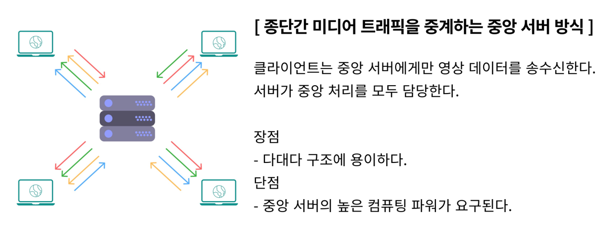
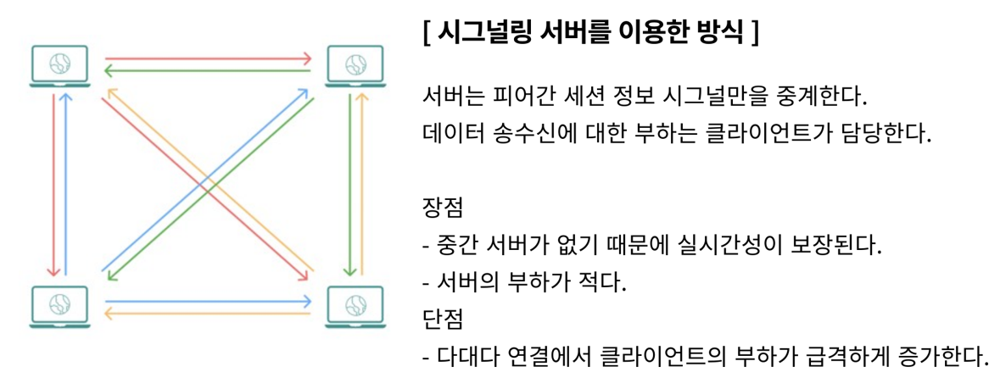

### 2팀 공통프로젝트

# 웹/모바일(웹 기술) 스켈레톤 프로젝트

## 카테고리

| Application       | Language      | Framework            |
| ----------------- | ------------- | -------------------- |
| ✅ Desktop Web    | ✅ JavaScript | ✅ Vue.js            |
| 🔲 Mobile Web     | 🔲 TypeScript | 🔲 React             |
| ✅ Responsive Web | 🔲 C/C++      | 🔲 Angular           |
| 🔲 Android App    | 🔲 C#         | 🔲 Node.js           |
| 🔲 iOS App        | 🔲 Python     | 🔲 Flask/Django      |
| 🔲 Desktop App    | ✅ Java       | ✅ Spring/Springboot |
|                   | 🔲 Kotlin     |                      |

## 📢 프로젝트 소개

<<<<<<< HEAD
<<<<<<< HEAD
=======


>>>>>>> aae644892d27ca7bc59c67fe84e8a338c3fe23ff
=======


>>>>>>> aae644892d27ca7bc59c67fe84e8a338c3fe23ff


<<<<<<< HEAD
<<<<<<< HEAD
=======


>>>>>>> aae644892d27ca7bc59c67fe84e8a338c3fe23ff
=======


>>>>>>> aae644892d27ca7bc59c67fe84e8a338c3fe23ff

### ❓ 왜 OPIck me를 사용해야 할까요?

- opic을 준비하는 데에 있어 번거로움을 제거하고 시간을 절약하여 바쁜 취준생의 효율적인 취업 준비를 위한 서비스이기 때문

<<<<<<< HEAD
=======

<<<<<<< HEAD
>>>>>>> aae644892d27ca7bc59c67fe84e8a338c3fe23ff
=======
>>>>>>> aae644892d27ca7bc59c67fe84e8a338c3fe23ff
### 🌟 특징

- 녹음본 스크립트 다시 듣기 가능(직접 다른 전자기기를 이용해 녹음하는 번거로움 제거)
- 자동으로 변환된 스크립트를 보면서 사용자가 실수한 부분 체크(시간 절약)
- .강사에게 즉각 피드백 신청 가능(사용자의 몰입도를 높이는 효과 기대)

### 💝 주요 기능

```
* 회원 관리 (회원가입, 로그인)
* 화상 채팅을 통한 1대1 강사 피드백 (비디오/ 마이크 On/Off, 스크립트 표시 및 수정)
* STT를 활용한 스크립트 자동 생성
* 손쉬운 나만의 스크립트 관리
<<<<<<< HEAD
<<<<<<< HEAD
* 외 사용자 편의 기능
=======
=======
>>>>>>> aae644892d27ca7bc59c67fe84e8a338c3fe23ff
* 외 사용자 편의 기능 
>>>>>>> aae644892d27ca7bc59c67fe84e8a338c3fe23ff
  (🗂️화상 채팅 상에서 스크립트 수정 및 저장, 📎 자신의 스크립트 오디오 파일 제공)
```

### ⚙️ 주요 기술

```
* WebSocket/ WebRTC
  => Web API와 Web Socket을 기반한 1대1 화상 채팅으로 실시간성 보장 및 웹 상에서 가벼운 WebRTC 동작이 가능합니다.
  => Signaling Server는 Spring Boot를 활용하여 SockJS와 StompJS 라이브러리를 활용합니다.
* Spring Security/ JWT Authentication
  => 사용자의 간편 로그인과 보안을 위해 Spring Security를 통해 사용자 정보를 암호화 합니다.
* JPA
  => 빠른 개발을 위해 JPA를 통해 데이터를 조작합니다.
* REST API
  => Server와 Frontend와의 효율적인 협업을 위해 REST API방식으로 통신합니다.
* S3
  => 효과적인 오디오 파일 저장을 위해 S3 저장소를 사용합니다.
```

### 💎 참조 리소스

```
* Bootstrap: 디자인 전반 적용
* Web API: 브라우저에서 제공하는 API를 활용하여 WebRTC 기능 구현
* STOMP : 텍스트 채팅 구현 사용
* Sock JS : 웹소켓 미지원 브라우저와의 호환을 위해 사용
* S3 : 오디오 파일 저장
* Google Cloud Speech API : 녹음 파일 자동 스크립트 변환을 위해 사용
```

### 🚢 배포 환경

```
URL : [https://i7b202.p.ssafy.io/]
```

## 팀 소개

<<<<<<< HEAD
=======


<<<<<<< HEAD
>>>>>>> aae644892d27ca7bc59c67fe84e8a338c3fe23ff
=======
>>>>>>> aae644892d27ca7bc59c67fe84e8a338c3fe23ff
- ⭐︎ 안태환 : 팀장, 프론트엔드 개발 및 Jira 관리자
- ⚝ 권다솜 : 프론트엔드 개발 및 Designer, UCC 제작자
- ⚝ 박수근 : 백엔드 개발 및 WebRTC
- ⚝ 박재영 : 백엔드 개발 AWS, CI/CD 담당자
- ⚝ 이다인 : 백엔드 개발 및 API 연결
- ⚝ 조항주 : 백엔드 개발 및 STT
<<<<<<< HEAD
<<<<<<< HEAD
=======
=======
>>>>>>> aae644892d27ca7bc59c67fe84e8a338c3fe23ff


>>>>>>> aae644892d27ca7bc59c67fe84e8a338c3fe23ff

## 프로젝트 상세 설명

### 개발 환경

- JIRA : 애자일 및 소프트웨어 개발 프로젝트를 기획, 트래킹 및 관리 협업 툴
- Gitlab : 깃 저장소 및 CI/CD, 이슈 추적, 보안성 테스트 등의 기능을 갖춘 웹 기반의 데브옵스 플랫폼
- Visual Studio Code : JavaScript 및 웹 개발을 위한 소스 코드 편집기, 다양한 확장 기능 제공
- IntelliJ : Spring Boot 프레임워크를 사용하기 위한 통합 개발 환경

### 🔨 기술 스택

Backend : [](https://camo.githubusercontent.com/ffc89314f61129fc7f961ca56a45c286487eee20765929ffa02a28606fd3b978/68747470733a2f2f696d672e736869656c64732e696f2f62616467652f4a4156412d3030373339363f7374796c653d666c61742d737175617265266c6f676f3d6a617661266c6f676f436f6c6f723d7768697465) [](https://camo.githubusercontent.com/e5e1b0f6385294f384736687f3e6083f5579cf8e583460fe3c303ce8b5b1e3c0/68747470733a2f2f696d672e736869656c64732e696f2f62616467652f537072696e672d3644423333463f7374796c653d666c61742d737175617265266c6f676f3d537072696e67266c6f676f436f6c6f723d7768697465) [](https://camo.githubusercontent.com/f9ab0bcf2b6a190a217794ae7c314fb84d1e3f2b2ab2df2a562800f8d9b4b701/68747470733a2f2f696d672e736869656c64732e696f2f62616467652f6d7973716c2d3434373941313f7374796c653d666c61742d737175617265266c6f676f3d6d7973716c266c6f676f436f6c6f723d7768697465)

Frontend : [](https://camo.githubusercontent.com/f626c2a8ff3685ee66b24d83543472a3a6c37c4b9f4878a66d3479af5219e749/68747470733a2f2f696d672e736869656c64732e696f2f62616467652f68746d6c2d4533344632363f7374796c653d666c61742d737175617265266c6f676f3d68746d6c35266c6f676f436f6c6f723d7768697465) [](https://camo.githubusercontent.com/997205b77cd7eac35fdae833c285ec8c87d0d45e26f5b5482a61f391a3733844/68747470733a2f2f696d672e736869656c64732e696f2f62616467652f6373732d3135373242363f7374796c653d666c61742d737175617265266c6f676f3d63737333266c6f676f436f6c6f723d7768697465) [](https://camo.githubusercontent.com/ac32cf17b7c94a457620afea3b88a874da6ef21fbfcfd6bf00e7ed823de78f8a/68747470733a2f2f696d672e736869656c64732e696f2f62616467652f6a6176617363726970742d4637444631453f7374796c653d666c61742d737175617265266c6f676f3d6a617661736372697074266c6f676f436f6c6f723d626c61636b) [](https://camo.githubusercontent.com/eae205e49befad940bdd0beed72669c18a69bd8ac6c09094af6324c9a3bb53af/68747470733a2f2f696d672e736869656c64732e696f2f62616467652f626f6f7473747261702d3739353242333f7374796c653d666c61742d737175617265266c6f676f3d626f6f747374726170266c6f676f436f6c6f723d7768697465)

- Web API, STOMP, Sock JS
- Vue3
- Javascript(ECMA6)
- HTML5, CSS3
- JAVA (Open JDK 1.8.0)
- Spring Boot
- MySQL 5.7, JPA
- Serverless Cloud(AWS)
- CI/CD (ubuntu)
- IntelliJ IDE

### 🚩 시스템 구성도


### 🎫 ERD

- 사용자 정보 저장을 위한 User 테이블

- script 정보 저장을 위한 Script 테이블

- 문제 저장을 위한 Question 테이블

- 화상채팅 후 피드백 내용을 저장을 위한 Feedback 테이블

- 상담 정보 저장을 위한 Consult 테이블

  ​

  

### 기능 상세 설명

👉️ [기능 설명 & 시연 시나리오](https://hana-275-programming.notion.site/a240903ebc7b499aa998b2f3c1a8eb4c) 👈️

1. 유저 - 회원 가입, 로그인, JWT 토큰 검증, 이메일과 닉네임 필수
2. 소개 페이지 - 사이트 소개
3. 화상채팅 참가 - 방 생성, 방 삭제, 방 참가, 방 삭제 시(상담 종료) 피드백 생성, 강사 상담종료 시 학생 화면 Feedback 페이지로 라우팅
4. 상담 관리 - 상담 생성 시 실시간 강사 화면에서 추가, 상담 매칭 완료 시 실시간으로 해당 상담 삭제
5. 화상채팅 관리 - 스크립트 on/off, 마이크 화면 on/off, 강사와 채팅, 텍스트에디터(강사화면), 강사화면과 학생화면 스크립트 수정부분 동기화
6. 스크립트 생성 - 문제 topic 및 난이도 설정, 문제 듣기 기능, 녹음 기능, 녹음된 내용 스크립트로 변환(STT)
<<<<<<< HEAD
7. 스크립트 관리 - 자신이 생성한 스크립트 카테고리 별로 분류, 자신이 녹음한 스크립트 다시 듣기, 스크립트에 관한 피드백
   신청, 스크립트 수정, 스크립트 삭제
8. 피드백 관리 - 강사가 수정한 피드백 부분 그대로 저장, 피드백 삭제

### WebRTC

=======
7. 스크립트 관리 - 자신이 생성한 스크립트 카테고리 별로 분류, 자신이 녹음한 스크립트 다시 듣기, 스크립트에 관한 피드백 신청, 스크립트 수정, 스크립트 삭제 
8. 피드백 관리 - 강사가 수정한 피드백 부분 그대로 저장, 피드백 삭제


### WebRTC


<<<<<<< HEAD
>>>>>>> aae644892d27ca7bc59c67fe84e8a338c3fe23ff
=======
>>>>>>> aae644892d27ca7bc59c67fe84e8a338c3fe23ff


### 스크립트 편집 및 동기화

<<<<<<< HEAD
<<<<<<< HEAD
- 기능 목표 : 스크립트 편집 및 동기화강사와 학생의 1대1 화상채팅을 통해 실시간으로 진행되는 피드백 내용을 학생화면에서 확인할 수 있습니다.
- 과정 :
  - 강사화면에서 편집가능한 div 태그를 활용해 텍스트 에디터를 구현
  - role이 학생이면 div 태그의 편집가능 속성을 지운다.
  - div 태그에는 onchange 이벤트 리스너가 구현되어 있지 않아 인터벌 함수를 이용해 0.1초마다 div 태그 안의 내용을 학생에게 전달합니다.중앙 서버를 이용한 통신이었다면 인터벌 함수를 사용
  - 바인딩을 하는 과정에서 방의 개수가 늘어날수록 서버의 부하가 크게 증가하겠지만 이전에 RTC 통신을 위해 피어간 연결을 진행했으므로 이를 이용하여 전달하면 위의 문제를 해결하면서 학생과 강사 화면을 동기화
  - 채팅창의 경우에도 웹소켓을 사용한 것이 아닌 위와 같은 방법을 사용해 소켓 서버가 강사와 학생사이에 오고가는 메세지를 관리할 필요가 없습니다.(소켓 서버에게로 오는 부하를 줄일 수 있다.)최종적으로 소켓서버는 화상채팅을 위한 피어간 첫 연결을 중계해주고 실시간으로 추가 삭제되는 상담 대기 리스트를 동기화해주는 역할만을 담당하기에 소켓서버에 들어가는 비용을 줄일 수 있다.

## 개발 환경 구성

Windows 기준 개발 환경 구성 설명

1. OpenJDK 설치

   1. JDK 다운로드 사이트에서 1.8.x 설치 파일 다운로드 및 실행

      - Zulu OpenJDK: https://www.azul.com/downloads/?version=java-8-lts&package=jdk
      - OJDK Build: https://github.com/ojdkbuild/ojdkbuild

   2. 설치 후 명령 프롬프트(cmd) 확인

      ```
      > java -version
      ```

      출력 예)

      ```
      openjdk version "1.8.0_192"
      OpenJDK Runtime Environment (Zulu 8.33.0.1-win64) (build 1.8.0_192-b01)
      OpenJDK 64-Bit Server VM (Zulu 8.33.0.1-win64) (build 25.192-b01, mixed mode)
      ```

2. 데이터베이스 구성 _(이미 설치되어 있거나 원격 DB를 사용하는 경우 설치 부분 생략)_

   1. MySQL 다운로드 사이트에서 Community 설치 파일 다운로드 및 실행

      - https://dev.mysql.com/downloads/installer/

   2. MySQL Server, MySQL Shell을 포함하여 설치

   3. DB 및 계정 생성

      - MySQL Shell 실행

        ```
        MySQL  JS > \connect root@localhost
        MySQL  localhost:3306  JS > \sql
        ```

      - DB 생성

        ```sql
        create database IF NOT EXISTS `ssafy_web_db` collate utf8mb4_general_ci;
        ```

## 디렉토리 구조

#### API Server

```
.
└── main
    ├── generated
    ├── java
    │   └── com
    │       └── ssafy
    │           ├── GroupCallApplication.java
    │           ├── api  /* REST API 요청관련 컨트롤러, 서비스, 요청/응답 모델 정의*/
    │           │   ├── controller
    │           │   │   ├── AuthController.java
    │           │   │ 	├── ConsultController.java
    │           │   │ 	├── FeedbackController.java
    │           │   │ 	├── QuestionController.java
    │           │   │ 	├── ScriptController.java
    │           │   │   └── UserController.java
    │           │   ├── request
    │           │   │   ├── ConsultRequestPostReq.java
    │           │   │	├── FeedbackRequestPostReq.java
    │           │   │	├── QuestionRandomGetReq.java
    │           │   │	├── ScriptModifyPutReq.java
    │           │   │	├── ScriptRegisterPostReq.java
    │           │   │	├── UserLoginPostReq.java
    │           │   │   └── UserRegisterPostReq.java
    │           │   ├── response
    │           │   │	├── ConsultMapRes.java
    │           │   │	├── ConsultRes.java
    │           │   │	├── FeedbackRes.java
    │           │   │	├── QuestionRes.java
    │           │   │	├── ScriptDetailRes.java
    │           │   │	├── ScriptListRes.java
    │           │   │   ├── UserLoginPostRes.java
    │           │   │   └── UserRes.java
    │           │   └── service
    │           │   	├── ConsultService.java
    │           │   	├── ConsultServiceImpl.java
    │           │   	├── FeedbackService.java
    │           │   	├── FeedbackServiceImpl.java
    │           │   	├── QuestionService.java
    │           │   	├── QuestionServiceImpl.java
    │           │   	├── ScriptService.java
    │           │   	├── ScriptServiceImpl.java
    │           │       ├── UserService.java
    │           │       └── UserServiceImpl.java
    │           ├── common /* 공용 유틸, 응답 모델, 인증, 예외처리 관련 정의*/
    │           │   ├── auth
    │           │   │   ├── JwtAuthenticationFilter.java
    │           │   │   ├── SsafyUserDetailService.java
    │           │   │   └── SsafyUserDetails.java
    │           │   ├── exception
    │           │   │   └── handler
    │           │   │       └── NotFoundHandler.java
    │           │   ├── model
    │           │   │   └── response
    │           │   │       └── BaseResponseBody.java
    │           │   └── util
    │           │       ├── JwtTokenUtil.java
    │           │       └── ResponseBodyWriteUtil.java
    │           ├── config /* WebMvc 및 JPA, Security, Swagger 등의 추가 플러그인 설정 정의*/
    │           │   ├── JpaConfig.java
    │           │   ├── SecurityConfig.java
    │           │   ├── SwaggerConfig.java
    │           │ 	├── UtilConfig.java
    │           │   └── WebMvcConfig.java
    │           ├── converter
    │           │	└── conventer.java
    │           ├── db /* 디비에 저장될 모델 정의 및 쿼리 구현 */
    │           │   ├── entity
    │           │   │   ├── Consult.java
    │           │   │ 	├── Feedback.java
    │           │   │ 	├── Question.java
    │           │   │ 	├── Script.java
    │           │   │   └── User.java
    │           │   └── repository
    │			│		├── ConsultRepository.java
    │			│		├── FeedbackRepository.java
    │			│		├── QuestionRepository.java
    │			│		├── ScriptRepository.java
    │			│		├── UserRepository.java
    │			│		└── UserRepositorySupport.java
    │			├── exhandler
    │			│   ├── advice
    │			│	│	└── ExControllerAdvice
    │			│	└── ErrorResult.java
    │			└── stt
    │				├── STT
    │				└── STT2
    └── resources
        └── application.properties /* 웹 리소스(서버 host/port, 디비 host/port/계정/패스워드) 관련 설정 정의 */
```

#### WebSocket Server

    .
    └── main
        ├── java
        │   └── com
        │       └── example.rtc_test_test
        │           ├── WebSocketApplication.java
        │           ├── configuration
        │           │   └── WebSocketConfiguration.java
        │           ├── controller
        │           │   ├── ChatController.java
        │           │   └── WebSocketEventListener.java
        │           └── domain
        │               ├── ChatMessage.java
        │               └── MessageType.enum
        └── resources
            └── application.properties

#### Frontend

    .
    └── node_modules
    ├── public
    │	├── favicon.ico
    │   └── index.html
    ├── src
    │   ├── api
    │	│	└── http.js
    │   ├── assets
    │	│	├── card
    │	│	│	└── ...
    │	│	├── 말풍선.jfif
    │	│	├── 스크립트_수정.gif
    │	│	├── 스크립트.gif
    │	│	├── 주제선택.gif
    │	│	├── books.jpg
    │	│	├── check.png
    │	│	├── intro.png
    │	│	├── logo.png
    │	│	├── Script_detail.mp4
    │	│	├── script생성.mp4
    │	│	└── surveymodal.mp4
    │   ├── components
    │	│	├── Modal
    │	│	│	├── ConsultCloseModal.vue
    │	│	│	├── ConsultFeedbackModal.vue
    │	│	│	├── ConsultStartModal.vue
    │	│	│	├── FeedbackDeleteModal.vue
    │	│	│	├── FeedbackModal.vue
    │	│	│	├── LoadingModal.vue
    │	│	│	├── LogoutModal.vue
    │	│	│	├── ScriptDeleteModal.vue
    │	│	│	└── SurveyModal.vue	
    │	│	├── BoardUser.vue
    │	│	├── Consultant.vue
    │	│	├── ConsultCard.vue
    │	│	├── Feedback.vue
    │	│	├── FeedbackCard.vue
    │	│	├── FooterNav.vue
    │	│	├── InputTopic.vue
    │	│	├── Login.vue
    │	│	├── MainPageNavbar.vue
    │	│	├── Register.vue
    │	│	├── Script.vue
    │	│	├── ScriptCard.vue
    │	│	├── ScriptDetail.vue
    │	│	├── ScriptEdit.vue
    │	│	├── ScriptEditForm.vue
    │	│	├── Sidebar.vue
    │	│	└── SiteIntroduce.vue
    │   ├── plugins
    │	│	├── font-awesome.js
    │	│	└── s3upload.js
    │	├── services
    │	│	├── auth-header.js
    │	│	├── auth.service.js
    │	│	└── user.service.js
    │	├── store
    │	│	├── auth.module.js
    │	│	├── consult.js
    │	│	├── feedback.js
    │	│	├── index.js
    │	│	├── navbar.js
    │	│	└── script.js
    │	├── views
    │	│	├── MainPageUnLoginView.vue
    │	│	├── MainPageView.vue
    │	│	└── WebrtcStudentView.vue
    │	├── app.vue
    │	├── main.js
    │	└── router.js
    ├── .gitignore
    ├── babel.config.js
    ├── jsconfig.json
    ├── package-lock.json
    ├── package.json
    └── vue.config.js

> > > > > > > a7fcf0e6d4c2f0925af8affca091abced1687737
=======
=======
>>>>>>> aae644892d27ca7bc59c67fe84e8a338c3fe23ff


- 기능 목표 : 스크립트 편집 및 동기화강사와 학생의 1대1 화상채팅을 통해 실시간으로 진행되는 피드백 내용을 학생화면에서 확인할 수 있습니다.
- 과정 :
  - 강사화면에서 편집가능한 div 태그를 활용해 텍스트 에디터를 구현 
  - role이 학생이면 div 태그의 편집가능 속성을 지운다.
  -  div 태그에는 onchange 이벤트 리스너가 구현되어 있지 않아 인터벌 함수를 이용해 0.1초마다 div 태그 안의 내용을 학생에게 전달합니다.중앙 서버를 이용한 통신이었다면 인터벌 함수를 사용
  - 바인딩을 하는 과정에서 방의 개수가 늘어날수록 서버의 부하가 크게 증가하겠지만 이전에 RTC 통신을 위해 피어간 연결을 진행했으므로 이를 이용하여 전달하면 위의 문제를 해결하면서 학생과 강사 화면을 동기화
  - 채팅창의 경우에도 웹소켓을 사용한 것이 아닌 위와 같은 방법을 사용해 소켓 서버가 강사와 학생사이에 오고가는 메세지를 관리할 필요가 없습니다.(소켓 서버에게로 오는 부하를 줄일 수 있다.)최종적으로 소켓서버는 화상채팅을 위한 피어간 첫 연결을 중계해주고 실시간으로 추가 삭제되는 상담 대기 리스트를 동기화해주는 역할만을 담당하기에 소켓서버에 들어가는 비용을 줄일 수 있다. 

<<<<<<< HEAD
>>>>>>> aae644892d27ca7bc59c67fe84e8a338c3fe23ff
=======
>>>>>>> aae644892d27ca7bc59c67fe84e8a338c3fe23ff
